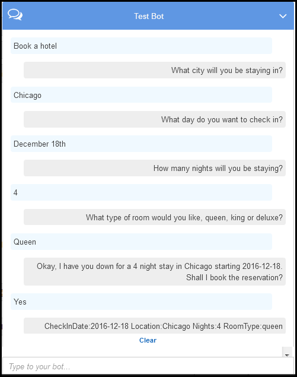
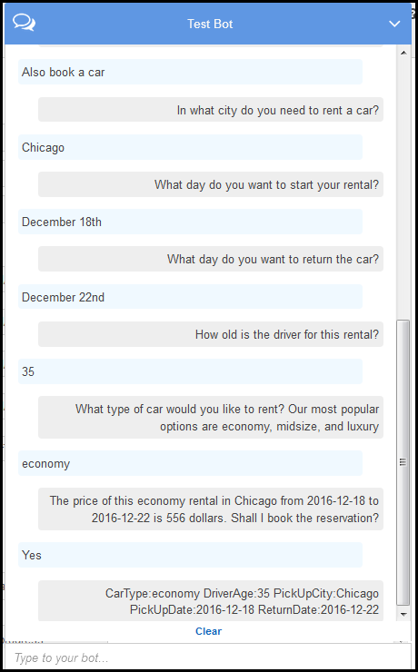

# Step 2: Create an Amazon Lex Bot

In this section, you create an Amazon Lex bot (BookTrip). 

1. Sign in to the AWS Management Console and open the Amazon Lex console at [https://console.aws.amazon.com/lex/](https://console.aws.amazon.com/lex/).

1. On the **Bots** page, choose **Create**.

1. On the **Create your Lex bot** page, 
   + Choose **BookTrip** blueprint.
   + Leave the default bot name (BookTrip).

1. Choose **Create**. The console sends a series of requests to Amazon Lex to create the bot. Note the following:

1. The console shows the BookTrip bot. On the **Editor** tab, review the details of the preconfigured intents (BookCar and BookHotel).

1. Test the bot in the test window. Use the following to engage in a test conversation with your bot:   


   From the initial user input ("Book a hotel"), Amazon Lex infers the intent (BookHotel). The bot then uses the prompts preconfigured in this intent to elicit slot data from the user. After user provide all of the slot data, Amazon Lex returns a response back to the client with a message that includes all the user input as a message. The client displays the message in the response as shown. 

   ```
   CheckInDate:2016-12-18 Location:Chicago Nights:5 RoomType:queen
   ```

   Now you continue the conversation and try to book a car.   


   Note that, 
   + There is no user data validation at this time. For example, you can provide any city to book a hotel.
   + You are providing some of the same information again (destination, pick-up city, pick-up date, and return date) to book a car. In a dynamic conversation, your bot should initialize some of this information based on prior input user provided for booking hotel. 

   In this next section, you create a Lambda function to do some of the user data validation, and initialization using cross-intent information sharing via session attributes. Then you update the intent configuration by adding the Lambda function as code hook to perform initialization/validation of user input and fulfill intent.

  
**Video Reference**  
https://www.youtube.com/watch?v=3NHAIlRPLGE

**Next Step**  
[Step 3: Create a Lambda function](ex3-step3.md)
